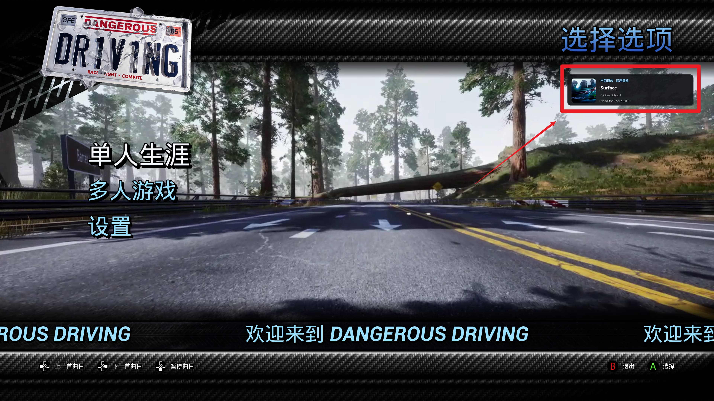

# Dangerous Driving Local Music

---



---

## 简体中文

这是一个面向 **Dangerous Driving（Windows x64）** 的 `dsound.dll` 代理插件。它把游戏原有 Spotify 控制接口连接到本地 FMOD 播放器，不登录 Spotify，也不会修改游戏存档中的账号、令牌或授权信息。

### 主要功能

- 支持 MP3、WAV、OGG 本地播放；
- 文件夹即专辑，音乐根目录中的散装曲目归入“未分类曲目”；
- 支持同名曲目元数据与封面：`Song.wav` + `Song.ini` + `Song.png`；
- 支持文件夹 `album.ini` 与 `cover.* / folder.* / front.*` 专辑封面；
- 使用 FMOD END 回调自动下一曲，并预加载下一首；
- 随机模式生成一次全曲库会话乱序队列，上一曲可以真正回退；
- 自绘曲目、专辑、暂停、继续、播放模式和布局状态通知；
- 最终音量为 `插件 Volume × 游戏持久 Spotify 音量`；
- 支持固定键盘与 XInput 手柄专辑控制；
- 支持在游戏内实时调整通知位置、大小、透明度并写回 INI；
- 支持一键重置通知布局；
- 支持完全关闭插件文件日志；
- 配置文件与 DLL 使用同名文件：`dsound.dll` + `dsound.ini`。

### 安装

把发行包中的文件放到：

```text
DangerousDriving\Binaries\Win64\
```

运行时文件：

```text
dsound.dll
dsound.ini
dsound.zh-hans.ini
dsound.en-us.ini
```

默认音乐目录：

```text
DangerousDriving\Content\Music\
```

### 音乐目录与专辑结构

```text
Music\
├─ Loose Song.wav
├─ Loose Song.ini
├─ Loose Song.png
└─ Album One\
   ├─ album.ini
   ├─ cover.jpg
   ├─ 01 - First Song.wav
   └─ 02 - Second Song.mp3
```

本项目不读取 ZIP 内音乐。普通文件路径可直接交给 FMOD，行为更稳定，也不会为 WAV 产生额外解压缓存。

### 播放顺序

正式发行版只使用**文件夹路径和文件名**建立稳定顺序，元数据只用于通知显示：

```text
专辑顺序：相对于 MusicPath 的文件夹路径自然排序
曲目顺序：音频主文件名自然排序（忽略扩展名作为主要比较）
```

音乐根目录中的散装曲目固定排在文件夹专辑之前。自然排序会把 `2` 排在 `10` 前面，并且不区分英文大小写。`TrackNumber`、`DiscNumber`、内嵌标签、同名 INI 与 `album.ini` 都不会改变播放顺序。需要调整顺序时，请直接修改文件夹名或音频文件名，例如 `01 - Intro.wav`、`02 - Song.mp3`。

### 播放模式

```text
Sequential  顺序播放
Random      全曲库会话乱序
SingleLoop  单曲循环
```

`Random` 在进入随机模式或重新扫描时生成一次固定的全曲库乱序队列。`Previous` / `Next` 只移动队列游标，不会每次重新抽签。

通过 `Home` 或 `LB + 十字键下` 切换模式后，插件会立即把 `PlayMode` 写回 `dsound.ini`。

### 音量模型

```text
FMOD 最终音量 = dsound.ini 的 Volume × 游戏持久 Spotify 音量
```

例如 `Volume=0.20`、游戏音量为 `95%`，最终输出约为 `19%`。游戏进入关卡或菜单时产生的临时 `SetVolumeOffset` 不参与计算。

### 固定播放控制

键盘：

| 按键 | 功能 |
|---|---|
| `Insert` | 上一张专辑 |
| `Page Up` | 下一张专辑 |
| `Home` | 切换播放模式并保存 |
| `Delete` | 游戏原有：上一曲 |
| `Page Down` | 游戏原有：下一曲 |
| `End` | 游戏原有：暂停/继续 |

XInput 手柄：

| 组合 | 功能 |
|---|---|
| `LB + 十字键左` | 上一张专辑 |
| `LB + 十字键右` | 下一张专辑 |
| `LB + 十字键下` | 切换循环模式并保存 |
| `LB + 十字键上` | 显示当前曲目、专辑和模式 |

严格互斥规则：

- 每个方向键在按下沿锁定为“普通、`LB`、`BACK`、`BACK+LB`”之一，直到该方向完全释放；
- 修饰键应先按下或与方向键同帧按下；先按方向再补按修饰键不会补触发插件动作；
- `LB+方向键`、`BACK+方向键`、`BACK+LB+方向键` 期间，游戏来源的上一曲、下一曲、暂停、播放和恢复全部被屏蔽；
- 中途增加或松开 `LB`/`BACK` 不会把当前方向会话切换成另一种功能；必须先松开方向键。

`LB`、`BACK` 和相关方向键组合是固定映射，不提供重映射选项。

### 游戏内通知布局调整

手柄：

| 组合 | 功能 |
|---|---|
| 按住 `BACK` + 十字键 | 按画面方向移动通知 |
| 按住 `BACK` + 按住 `LB` + 十字键上` | 放大通知 |
| 按住 `BACK` + 按住 `LB` + 十字键下` | 缩小通知 |
| 按住 `BACK` + 按住 `LB` + 十字键左` | 降低背景不透明度 |
| 按住 `BACK` + 按住 `LB` + 十字键右` | 提高背景不透明度 |
| 按住 `BACK` + R3` | 重置位置、大小和透明度 |

键盘：

| 组合 | 功能 |
|---|---|
| `Ctrl + -` | 向上移动通知 |
| `Ctrl + =` | 向下移动通知 |
| `Shift + -` | 向左移动通知 |
| `Shift + =` | 向右移动通知 |
| `Alt + -` | 缩小通知 |
| `Alt + =` | 放大通知 |
| 直接按 `-` | 降低背景不透明度 |
| 直接按 `=` | 提高背景不透明度 |
| `Backspace` | 重置位置、大小和透明度 |

调整规则：

- 位置每次变化 8 个物理像素；
- 大小与透明度每次变化 5%；
- 短按精调，按住约 350 毫秒后开始连续调整；
- 手柄松开 `BACK` 时保存；
- 键盘停止调整约 1 秒后保存；
- 重置操作立即保存；
- 保存内容为 `NotificationPosition`、`NotificationMarginX`、`NotificationMarginY`、`NotificationScalePercent` 和 `NotificationOpacityPercent`；
- 通知至少保留 48 像素在游戏客户区内，防止完全移出画面；
- 调整期间会强制显示布局预览，不受普通曲目信息通知开关影响。

LocalMusic 仍会尝试接管游戏目录内模块的普通 `XInputGetState`、序号 100 的 `XInputGetStateEx`、`XInputGetKeystroke`，以及运行时缓存的 XInput 函数指针。命中这些路径时，游戏收到的布局组合按键会被清除；插件继续从原始 XInput 后端读取完整状态。由于部分 UE4 输入路径可能绕过扫描，发行版还在游戏媒体函数层设置统一同步硬门：检测到 `LB/BACK + 方向键`、已锁定的插件方向会话，或组合释放后 750 毫秒吸收窗口时，`PreviousTrack`、`NextTrack`、`Pause`、`Play`、`Unpause` 都不会进入本地播放器。即使日志中的 XInput 捕获累计数为 0，组合键也不会再交叉改变曲目或播放状态；但游戏自身的非媒体菜单导航仍可能看到方向输入。

重置默认值：

```ini
NotificationPosition=TopRight
NotificationMarginX=32
NotificationMarginY=32
NotificationScalePercent=100
NotificationOpacityPercent=92
```

### 发行版精简配置

普通 `dsound.ini` 只保留用户真正会调整的项目：

- 日志总开关；
- 音乐目录；
- 播放模式；
- 插件音量倍率；
- 曲目、暂停和继续通知开关；
- 通知持续时间、大小、透明度、锚点和 X/Y 偏移。

认证、Hook、自动播放、自动下一曲、预加载、文件夹专辑、侧挂元数据、封面、高 DPI 和兼容性策略使用稳定内置值。旧 INI 或开发者手工加入的高级键仍可读取，以保持兼容。 新版以 `[LocalMusic]` 为主配置节，旧 `[LocalSpotify]` 仅作为兼容回退读取。

详细说明见 [`INI配置说明.md`](INI配置说明.md)。开发者调试未来 EXE 时可参考 `开发者/高级配置参考.ini`，该文件不会被插件自动读取。

### 运行语言

`dsound.ini` 的 `Language=auto` 会按 Windows UI 语言选择：中文环境使用 `zh-hans`，其他环境使用 `en-us`。官方包提供：

- `dsound.zh-hans.ini`
- `dsound.en-us.ini`

语言文件名由实际 DLL 主文件名派生。若代理 DLL 改名为 `winmm.dll`，对应文件应改为 `winmm.zh-hans.ini`、`winmm.en-us.ini`。也可复制任一语言文件并使用自定义小写 BCP 47 风格标签，例如 `dsound.ja-jp.ini`，然后设置 `Language=ja-jp`。

回退顺序为：指定语言文件 → `en-us` → DLL 内置 `zh-hans`。单个翻译键缺失时也按同一顺序回退，因此不完整的用户语言文件不会让通知或日志变成空白。

### 日志开关

```ini
EnableLogging=true
```

设为 `false` 并重启游戏后，插件不会创建、截断或追加 `dsound.log`。已经存在的旧日志会保留原样；需要清理时可在游戏退出后手工删除。排查兼容性、Hook 或播放问题时应临时改回 `true`。

### 元数据优先级

曲目信息按字段合并：

```text
音频内嵌标签
→ 与音频同名的 Song.ini 补缺
→ 文件名回退
→ 所属文件夹 album.ini 补缺
→ 文件夹名称回退
```

封面优先级：

```text
音频内嵌封面
→ 与音频同名图片
→ Song.ini 指定的图片
→ 文件夹专辑封面
→ 默认音乐图标
```

### 已知限制

- 部分游戏菜单会把左右导航同时映射到 Spotify 上一曲/下一曲；当前没有可靠方法区分真正换曲与菜单导航。
- 关卡暂停菜单不一定调用 Spotify `Pause`，因此音乐和暂停通知可能不跟随该界面。
- 真正的独占全屏可能遮挡普通 Win32 分层通知窗口；窗口化或无边框全屏更可靠。
- 若日志中“XInput 输入捕获扫描”的累计槽位始终为 `0`，说明该设备/输入映射没有经过当前可识别的 XInput 路径；布局编辑仍可用，但游戏可能同时响应按键。
- 当前公开源码包未在本环境生成 Windows DLL；必须使用 Windows SDK 和 MSVC 实际构建并测试。

### 编译与打包

要求：

- Windows 10/11 x64；
- Visual Studio 2019 或 2022；
- Windows SDK；
- CMake 3.20 或更高版本。

在 x64 Native Tools Command Prompt 中运行：

```bat
build-release.bat
```

生成可发布 ZIP：

```bat
package-release.bat 1.0.0
```

输出位于 `dist`。脚本会打包 `dsound.dll`、精简 `dsound.ini`、两份官方语言文件、安装说明和用户文档，并生成 SHA-256。

## 版权归属

Dangerous Driving 由 Three Fields Entertainment 创作
Dangerous Driving 是 Three Fields Entertainment Limited 的商标

---

## English

This is a `dsound.dll` proxy plugin for **Dangerous Driving (Windows x64)**. It redirects the game's original Spotify control interface to a local FMOD player without signing in to Spotify or modifying saved accounts, tokens, or authorization data.

### Main features

- Local MP3, WAV, and OGG playback;
- folders are treated as albums, while loose tracks in the music root are grouped under “Unsorted Tracks”;
- same-name sidecar metadata and artwork: `Song.wav` + `Song.ini` + `Song.png`;
- folder-level `album.ini` and `cover.* / folder.* / front.*` artwork;
- FMOD END callback auto-advance with next-track preloading;
- one fixed full-library shuffle queue per session, allowing Previous to return to the actual prior track;
- custom track, album, pause, resume, play-mode, and layout-status notifications;
- final volume is `plugin Volume × persistent in-game Spotify volume`;
- fixed keyboard and XInput controller album controls;
- in-game notification position, size, and opacity adjustment with INI persistence;
- one-button notification layout reset;
- complete plugin file-logging disable switch;
- matching configuration and DLL names: `dsound.dll` + `dsound.ini`.

### Installation

Copy the release files to:

```text
DangerousDriving\Binaries\Win64\
```

Runtime files:

```text
dsound.dll
dsound.ini
dsound.zh-hans.ini
dsound.en-us.ini
```

The default music directory is:

```text
DangerousDriving\Content\Music\
```

### Music folders and album structure

```text
Music\
├─ Loose Song.wav
├─ Loose Song.ini
├─ Loose Song.png
└─ Album One\
   ├─ album.ini
   ├─ cover.jpg
   ├─ 01 - First Song.wav
   └─ 02 - Second Song.mp3
```

The plugin does not read music directly from ZIP archives. Normal file paths are more reliable for FMOD and avoid additional extraction caches for WAV files.

### Playback order

The release build uses only **folder paths and filenames** to create a stable order. Metadata is display-only:

```text
Album order: natural sort of folder paths relative to MusicPath
Track order: natural sort of the audio stem, with the full filename as a tie-breaker
```

Loose tracks in the music root are always placed before folder albums. Natural sorting places `2` before `10` and is case-insensitive. `TrackNumber`, `DiscNumber`, embedded tags, same-name INI files, and `album.ini` never change playback order. Rename folders or audio files to change the order, for example `01 - Intro.wav` and `02 - Song.mp3`.

### Play modes

```text
Sequential  Sequential playback
Random      Full-library session shuffle
SingleLoop  Repeat the current track
```

`Random` creates one fixed full-library shuffled queue when the mode is entered or the library is rescanned. `Previous` and `Next` only move the queue cursor; they do not draw a new random track every time.

After changing the mode with `Home` or `LB + D-pad Down`, the plugin immediately writes `PlayMode` back to `dsound.ini`.

### Volume model

```text
Final FMOD volume = Volume in dsound.ini × persistent in-game Spotify volume
```

For example, `Volume=0.20` with an in-game volume of `95%` produces approximately `19%` output. Temporary `SetVolumeOffset` values sent while entering menus or levels are ignored.

### Fixed playback controls

Keyboard:

| Key | Action |
|---|---|
| `Insert` | Previous album |
| `Page Up` | Next album |
| `Home` | Cycle and save play mode |
| `Delete` | Original game action: previous track |
| `Page Down` | Original game action: next track |
| `End` | Original game action: pause/resume |

XInput controller:

| Combination | Action |
|---|---|
| `LB + D-pad Left` | Previous album |
| `LB + D-pad Right` | Next album |
| `LB + D-pad Down` | Cycle and save loop mode |
| `LB + D-pad Up` | Show current track, album, and mode |

Strict isolation rules:

- each direction locks to exactly one mode—Plain, `LB`, `BACK`, or `BACK+LB`—on its rising edge and keeps that mode until the direction is fully released;
- press the modifier first or in the same sample as the direction; adding a modifier after a direction is already held does not retroactively trigger a plugin action;
- while an `LB+D-pad`, `BACK+D-pad`, or `BACK+LB+D-pad` session is active, game-originated Previous, Next, Pause, Play, and Unpause commands are all blocked;
- adding or releasing `LB`/`BACK` mid-hold never converts the current direction session into another function. Release the direction first.

`LB`, `BACK`, and the related directional combinations are fixed mappings and are intentionally not remappable.

### In-game notification layout adjustment

Controller:

| Combination | Action |
|---|---|
| Hold `BACK` + D-pad | Move the notification in screen direction |
| Hold `BACK` + Hold `LB` + D-pad Up` | Increase notification size |
| Hold `BACK` + Hold `LB` + D-pad Down` | Decrease notification size |
| Hold `BACK` + Hold `LB` + D-pad Left` | Reduce panel opacity |
| Hold `BACK` + Hold `LB` + D-pad Right` | Increase panel opacity |
| Hold `BACK` + R3` | Reset position, size, and opacity |

Keyboard:

| Combination | Action |
|---|---|
| `Ctrl + -` | Move notification up |
| `Ctrl + =` | Move notification down |
| `Shift + -` | Move notification left |
| `Shift + =` | Move notification right |
| `Alt + -` | Decrease notification size |
| `Alt + =` | Increase notification size |
| Plain `-` | Reduce panel opacity |
| Plain `=` | Increase panel opacity |
| `Backspace` | Reset position, size, and opacity |

Adjustment behavior:

- position changes by 8 physical pixels per step;
- size and opacity change by 5% per step;
- a short press provides fine adjustment, while holding for about 350 ms starts continuous adjustment;
- controller changes are saved when `BACK` is released;
- keyboard changes are saved after about 1 second without another adjustment;
- reset actions are saved immediately;
- the saved keys are `NotificationPosition`, `NotificationMarginX`, `NotificationMarginY`, `NotificationScalePercent`, and `NotificationOpacityPercent`;
- at least 48 pixels of the notification remain inside the game client area so it cannot become completely unreachable;
- a layout-preview notice remains available during adjustment even when normal track notifications are disabled.

LocalMusic still attempts to capture normal `XInputGetState`, ordinal-100 `XInputGetStateEx`, `XInputGetKeystroke`, and cached XInput pointers in modules under the game directory. When those paths are found, layout-chord buttons are removed from the state returned to the game while the plugin continues reading the complete raw state. Because some UE4 input paths can bypass that scan, the release also has one synchronous gate at the game-media layer. While an `LB/BACK + D-pad` chord, a locked plugin direction session, or the 750 ms post-release absorption window is active, `PreviousTrack`, `NextTrack`, `Pause`, `Play`, and `Unpause` are all rejected before reaching the local player. This prevents chord cross-contamination even when the XInput capture count remains zero, although unrelated game-menu navigation may still see the D-pad input.

Reset defaults:

```ini
NotificationPosition=TopRight
NotificationMarginX=32
NotificationMarginY=32
NotificationScalePercent=100
NotificationOpacityPercent=92
```

### Simplified release configuration

The normal `dsound.ini` only exposes settings regular users are expected to change:

- master file-logging switch;
- music directory;
- play mode;
- plugin volume multiplier;
- track, pause, and resume notification switches;
- notification duration, size, opacity, anchor, and X/Y offsets.

Authentication, hooks, auto-start, auto-advance, preloading, folder albums, sidecar metadata, artwork, high-DPI behavior, and compatibility policies use stable built-in defaults. Legacy or manually added advanced keys remain readable for backward compatibility. New releases use `[LocalMusic]`; legacy `[LocalSpotify]` keys are read only as a compatibility fallback.

See [`INI配置说明.md`](INI配置说明.md) for details. Developers testing a future executable can reference `开发者/高级配置参考.ini`; that file is not loaded automatically.

### Runtime language

`Language=auto` in `dsound.ini` follows the Windows UI language: Chinese systems use `zh-hans`, while other systems use `en-us`. The official package includes:

- `dsound.zh-hans.ini`
- `dsound.en-us.ini`

Language filenames are derived from the actual proxy DLL basename. If the proxy is renamed to `winmm.dll`, rename the language files to `winmm.zh-hans.ini` and `winmm.en-us.ini`. Users may copy either file, use a lowercase BCP 47-style tag such as `dsound.ja-jp.ini`, and set `Language=ja-jp`.

Fallback order is: requested language file → `en-us` → built-in `zh-hans`. Missing individual keys use the same fallback chain, so an incomplete custom translation cannot produce blank notifications or log messages.

### Logging switch

```ini
EnableLogging=true
```

Set it to `false` and restart the game to prevent the plugin from creating, truncating, or appending `dsound.log`. Existing logs are left untouched and may be deleted manually after the game exits. Re-enable logging while diagnosing compatibility, hook, or playback problems.

### Metadata priority

Track fields are merged in this order:

```text
Embedded audio tags
→ same-name Song.ini fills missing fields
→ filename fallback
→ folder album.ini fills missing fields
→ folder-name fallback
```

Artwork priority:

```text
Embedded artwork
→ same-name image
→ image explicitly named in Song.ini
→ folder album artwork
→ default music icon
```

### Known limitations

- Plain D-pad input remains owned by the game; `LB+D-pad`, `BACK+D-pad`, and `BACK+LB+D-pad` are locked as separate sessions.
- All game-originated Previous, Next, Pause, Play, and Unpause calls are synchronously blocked during plugin chords and for 750 ms after release.
- The in-level pause menu does not always call Spotify `Pause`, so music and pause notifications may not follow that screen.
- Exclusive fullscreen may cover a normal layered Win32 notification window; windowed or borderless fullscreen is more reliable.
- If the cumulative slot count in the `XInput input capture scan` log remains `0`, the game may still react to D-pad navigation at its own menu layer. The unified media gate still prevents plugin chords from causing Previous, Next, Pause, Play, or Unpause.
- The distributed DLL was tested in Dangerous Driving x64. For rebuilding the source, Visual Studio 2022 with the Windows SDK and an x64 Release configuration remains the recommended toolchain.

### Build and package

Requirements:

- Windows 10/11 x64;
- Visual Studio 2019 or 2022;
- Windows SDK;
- CMake 3.20 or newer.

Run from an x64 Native Tools Command Prompt:

```bat
build-release.bat
```

Create a distributable ZIP with:

```bat
package-release.bat 1.0.0
```

Output is written to `dist`. The script packages `dsound.dll`, the simplified `dsound.ini`, both official language files, installation instructions, user documentation, and a SHA-256 file.


## DirectSound 导出序号修复

本发行候选版显式固定 `dsound.def` 中所有 DirectSound/COM 导出序号，避免游戏按序号导入时在 DLL 入口前失败。若曾遇到“无法定位序数 12”，请使用本版重新编译。

## DirectSound export ordinal fix

This release candidate explicitly pins all DirectSound/COM export ordinals in `dsound.def`, preventing loader-time failures when the game imports by ordinal. If you previously saw an “ordinal 12 not found” error, rebuild from this version.

## Copyright Ownership

Dangerous Driving created by Three Fields Entertainment.
Dangerous Driving is a trademark of Three Fields Entertainment Limited.

